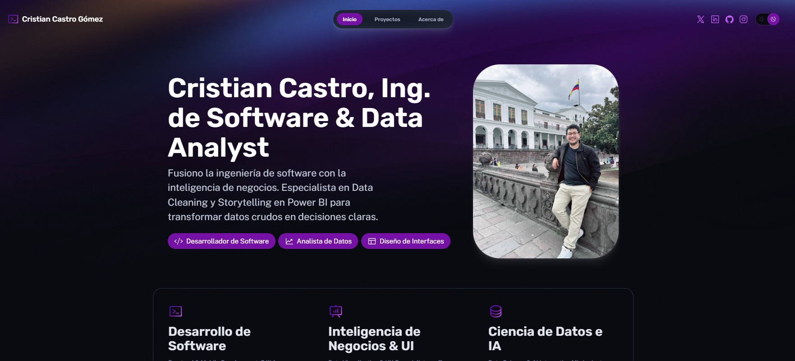

# 🚀 Cristian Castro — Software Engineer & Data Enthusiast

Portafolio profesional desarrollado para presentar mi perfil como **Ingeniero de Software**, con experiencia en **Frontend, Backend y Business Intelligence**, enfocado en crear soluciones tecnológicas con impacto real y valor estratégico.

🔗 **Sitio web:** https://cristiancastrodev.vercel.app  
🔗 **LinkedIn:** https://www.linkedin.com/in/cristian-jefferson-castro-gómez  
🔗 **GitHub:** https://github.com/kencrisg  

---

## 🧠 Sobre mí

Soy desarrollador de software con fuerte interés en el **desarrollo full-stack** y el **análisis de datos**.  
Durante mi formación académica me especialicé en **Business Intelligence**, trabajando con **Power BI Desktop y Power BI Service**, lo que despertó mi pasión por el mundo de los datos y la toma de decisiones basada en información.

Disfruto diseñar interfaces modernas, construir APIs escalables y transformar datos en conocimiento accionable.

---

## 🛠️ Tecnologías Principales

### Frontend
- Astro
- React
- HTML5, CSS3, JavaScript
- Tailwind CSS
- UX/UI básico y diseño responsivo

### Backend
- Node.js
- NestJS
- APIs REST
- Autenticación y control de roles
- Bases de datos relacionales (SQL)

### Mobile
- Flutter (Dart)
- Consumo de APIs
- Gestión de estado
- Visualización de datos

### Business Intelligence & Data
- Power BI Desktop
- Power BI Service
- Modelado de datos
- Dashboards interactivos
- ETL básico
- Análisis para toma de decisiones

---

## 📌 Proyectos Destacados

### 🔹 Blindshades — Plataforma Web Full-Stack
Aplicación web desarrollada con **NestJS** en el backend y **React + Tailwind CSS** en el frontend.  
Proyecto desplegado y utilizado por un negocio real del sector comercial.

**Características:**
- Arquitectura escalable
- Interfaz moderna e interactiva
- Despliegue en producción
- Enfoque en experiencia de usuario

---

### 🔹 Pasarela de Pagos — App Móvil (Flutter)
Frontend móvil de una pasarela de pagos académica, conectada a un backend en **NestJS**.

**Funcionalidades:**
- Login para administradores y clientes
- Aprobación y rechazo de transacciones
- Historial de pagos
- Visualización de métricas con gráficas
- Dark Mode

**Tecnologías y librerías usadas:**
- Flutter & Dart
- dio (consumo de APIs)
- shared_preferences
- flutter_secure_storage
- fl_chart (gráficas)
- flutter_animate
- url_launcher

---

### 🔹 Artículo Científico — Business Intelligence
📄 **A Data-Driven Approach to Strategic Decision-Making in Academic Linkage Process**

Artículo derivado de mi tesis de grado, enfocado en el uso de **Business Intelligence** para mejorar la toma de decisiones estratégicas en procesos académicos de vinculación con la sociedad.

**Aportes:**
- Análisis de datos institucionales
- Modelado de indicadores clave
- Uso de dashboards en Power BI
- Enfoque en decisiones basadas en datos

---

## 🎯 Enfoque Profesional

- Desarrollo Full-Stack
- Análisis y visualización de datos
- Soluciones orientadas a negocio
- Aprendizaje continuo
- Trabajo con metodologías ágiles

---

## 📬 Contacto

Estoy abierto a oportunidades **remotas o presenciales**, donde pueda aportar con mis conocimientos y seguir creciendo profesionalmente.

📧 **Email:** kencrisgdev@gmail.com
💼 **LinkedIn:** https://www.linkedin.com/in/cristian-jefferson-castro-gómez  

---

⭐ Si te interesa mi perfil, ¡no dudes en contactarme!
